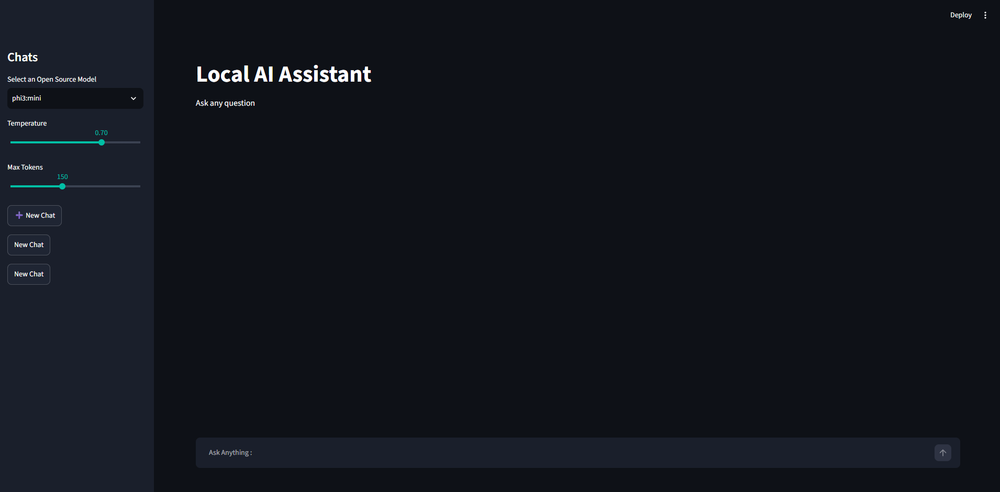
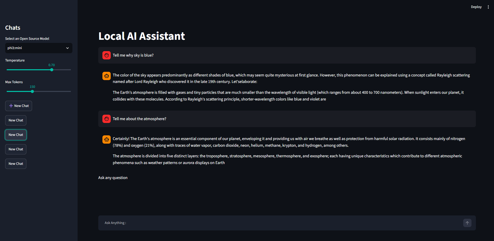
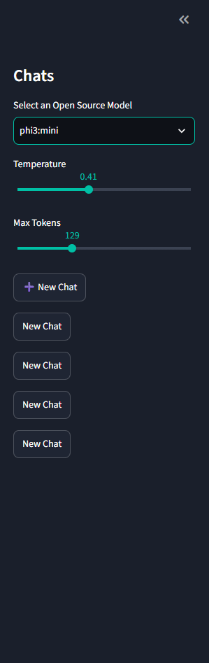
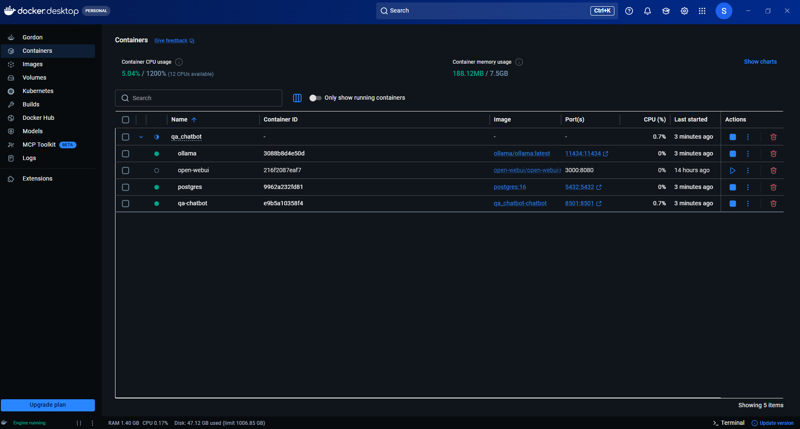
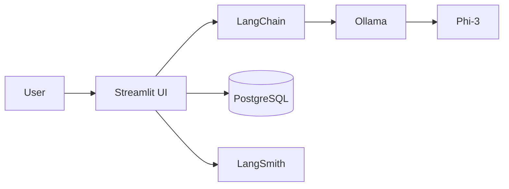
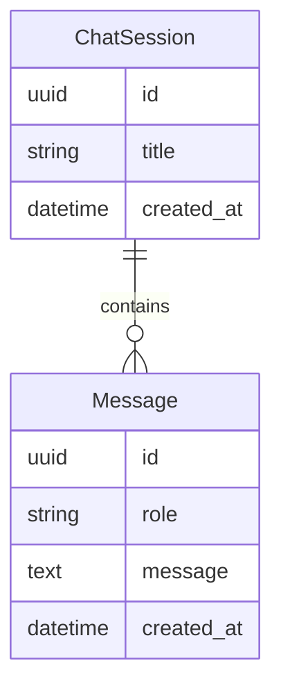

# 🤖 Local AI Portfolio Chatbot

> Production-ready Local LLM Chat Assistant powered by Ollama, LangChain, PostgreSQL, Docker and Streamlit.

## Table of Contents

- Overview
- Features
- Demo
- Screenshots
- Architecture
- Tech Stack
- Installation
- Docker
- Environment Variables
- Database
- Roadmap
- Future Improvements
- License

## Overview
A production-oriented **local Generative AI chatbot** built with **Streamlit**, **LangChain**, **Ollama**, and **PostgreSQL**.

## Features

| Feature        | Description              | Status |
| -------------- | ------------------------ | ------ |
| Chat History   | PostgreSQL persistence   | ✅     |
| Multiple Chats | Session management       | ✅     |
| Rename Chats   | Rename conversations     | ✅     |
| Docker         | Containerized deployment | ✅     |
| Streaming      | Token streaming          | 🚧     |


## 🎥 Demo


> Replace this GIF with a 60–90 second walkthrough.


## Screenshots

### Home Screen



---

### Chat Window



---

### Sidebar



---

### Docker Containers



---

### PostgreSQL


---

### LangSmith Trace


## Architecture Diagram

           

## Tech Stack
| Category      | Technology |
| ------------- | ---------- |
| Frontend      | Streamlit  |
| LLM           | Ollama     |
| Model         | Phi-3      |
| Framework     | LangChain  |
| ORM           | SQLAlchemy |
| Database      | PostgreSQL |
| Container     | Docker     |
| Observability | LangSmith  |


## Project Structure


    Local-AI-Portfolio-Chatbot/
                          ├── app.py
                          ├── helpers.py
                          ├── postgres/
                          │   ├── db.py
                          │   ├── models.py
                          │   └── initialize.py
                          ├── Dockerfile
                          ├── docker-compose.yml
                          ├── requirements.txt
                          ├── docs/
                          │   ├── images/
                          │   └── demo.gif
                          └── README.md

## Environment Variables
| Variable          | Description     |
| ----------------- | --------------- |
| OLLAMA_HOST       | Ollama endpoint |
| LANGCHAIN_API_KEY | LangSmith       |
| LANGCHAIN_PROJECT | Project Name    |
| DATABASE_URL      | PostgreSQL      |

## Database Schema


## Quick Start
```bash
1. Clone

2. Create virtual environment

3. Install dependencies

4. Configure .env

5. Start Docker

6. Pull Phi-3

7. Launch Streamlit
```

## Performance Metrics
| Metric                | Value  |
| --------------------- | ------ |
| Average Response Time | ~X sec |
| Startup Time          | ~X sec |
| Concurrent Sessions   | ~X      |
| Model Load Time       | ~X      |
| Database Latency      | ~X      |


## Roadmap

- [x] PostgreSQL Chat History
- [x] Multiple Chats
- [x] Rename Chat
- [x] Docker Support
- [x] LangSmith Integration
- [ ] Streaming Responses
- [ ] Multi-model Support
- [ ] Document Upload
- [ ] RAG
- [ ] Vector Database
- [ ] Export Chat
- [ ] Authentication
- [ ] REST API
- [ ] Kubernetes
- [ ] CI/CD

## License
MIT

## Acknowledgement
- LangChain
- Ollama
- Streamlit
- PostgreSQL
- SQLAlchemy